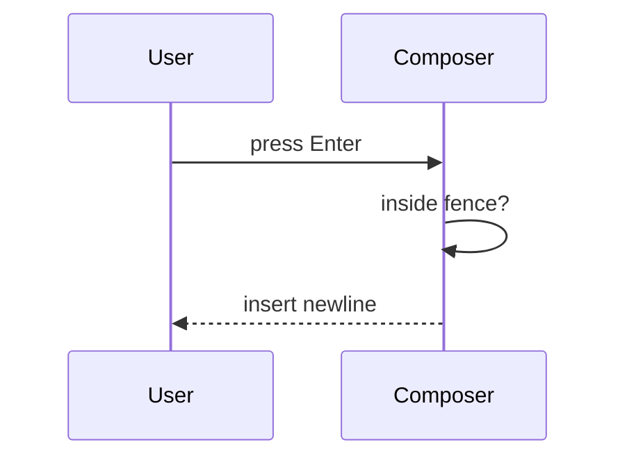

# PSCI Create Pull Request

Write the pull request for a teammate who did not watch the work happen. They can open the Files tab. They cannot recover the purpose from a path list, and they do not want the diff narrated back to them.

The PR body is a briefing, not a walkthrough. Say why the change exists and what is now true. Then prove it. Stop.

Read [writing-style.md](writing-style.md) before writing the body. Follow it for all original PR prose.

The body skeleton comes from the target repo's `.github/PULL_REQUEST_TEMPLATE.md`. Its headings, order, separators, HTML comments, checklist lines, and ticket link stay exactly as the file has them, even when they conflict with sentence-case headings. Never add, remove, or rename a section.

## Audience

The reviewer is missing the conversation, the ticket rabbit holes, and the dead ends. Answer two questions first:

1. Why does this exist?
2. What is now true that was not true before?

Then show proof it works. If a sentence only helps someone who already knows the diff, cut it. If a sentence describes how the code does something, cut it too. The diff already shows how.

## Altitude

Write at the altitude of a product update to your team lead, not a code review comment. The test: a PM who never opens the Files tab should understand the whole body. An engineer should learn what to look for, not what they will find.

Describe behavior, not mechanism:

- Behavior: "Enter inside a code fence inserts a newline."
- Mechanism: "The keydown handler checks fence state before calling submit." Cut this.

Cut anything at the level of:

- Which function, hook, class, helper, or variable does the work
- The order of operations inside the code
- Every edge case handled, every branch, every guard
- What each commit did
- Which tests were added or what they cover
- The diff restated as prose

Keep only what a reviewer would miss without you: the problem, the decision, and anything surprising.

## Length

Shorter is better. These are ceilings, not targets.

| Section | Ceiling |
| --- | --- |
| What Changed | 1 to 3 sentences |
| Context & Implementation Details | 2 short paragraphs, plus at most one visual |
| Validation steps | 3 to 6 numbered steps |
| Whole body, excluding template text | About 200 words |

A one-line copy fix gets a one-sentence body. A large feature still fits in two paragraphs if you stay at the right altitude. If you cannot say it in two paragraphs, you are describing mechanism. Go back up a level.

When in doubt, cut it. The reviewer can ask.

## Hard bans

Never put any of these in the PR body:

- A files-changed list
- `git diff --stat`, path inventories, or "touched X, Y, Z"
- New file, module, or API inventories by path
- File trees
- Internal function, hook, class, or variable names
- Step-by-step narration of what the code does
- Test file names or test case inventories
- HTML explainers (GitHub will not open them)
- AI attribution, co-author trailers, or tool watermarks
- Sycophantic filler or "comprehensive" throat-clearing
- Empty Proof It Works placeholders presented as done

`git diff` is for you. The Files tab is for the reviewer. The body is the why, the what, and proof.

Do not invent product claims, metrics, or motivations that are not in the ticket, the conversation, or the diff. If the ticket and the diff disagree, say so in one sentence.

## Workflow

1. Confirm branch, ticket key, and git state.
2. Read `.github/PULL_REQUEST_TEMPLATE.md` in the target repo. That file is the body skeleton.
3. Read the Jira ticket and the actual diff until you can state the purpose in two sentences without looking at paths. Those two sentences are the seed of the body.
4. Collect Proof It Works before creating the PR. Look in the conversation for an ephemeral URL (`*.awardedai.dev`). Look for screenshots, GIFs, videos, or a terminal capture of the run.
5. Commit with a conventional message if there are uncommitted changes the user asked to ship.
6. Push with upstream tracking.
7. Draft the body inside the repo template. Then cut it in half. Then create the PR with `gh`.

If you have neither an ephemeral URL nor visual proof, stop and ask. Do not open a PR with blank `_ [https://...] _` proof. There is no opt-out.

```bash
git status --short --branch
git log --oneline -5
git diff [base]...HEAD
```

Inspect the diff to understand behavior. Do not paste that output into the PR. Do not summarize it either.

Commit:

```bash
git commit -m "feat(DEV-1234): short imperative subject" -m "Why this change exists.
What behavior is now different."
```

Push:

```bash
git push -u origin HEAD
```

Never force push without explicit user approval. Never update git config. Never add `Co-authored-by` trailers for AI tools. Never skip hooks unless the user asks.

## PR title

`DEV-XXXX <type>: <description>`

- Ticket key first, uppercase
- Conventional type: `feat`, `fix`, `refactor`, `chore`, `docs`, `test`, `perf`
- Description is the human-facing change, not a file name

Examples:

- `DEV-1235 fix: keep Enter from sending chat messages inside code fences`
- `DEV-4321 feat: add Okta SSO login`
- `DEV-2890 refactor: share validation between invite and signup`

## PR body

Use the target repo's `.github/PULL_REQUEST_TEMPLATE.md` verbatim as the skeleton. Replace each italic placeholder with your prose. Keep every HTML comment. Do not add sections. Do not rename sections. Do not reorder them.

PSCI repos share one template with small differences. Some have a Proof It Works section, some do not. One names the review section Validation instead of Validation steps. One has a different checklist. Follow the file in front of you, not this example.

For reference, this is the chatbot-ui template as of September 2026:

```markdown
### Ticket(s)

[DEV-####](https://procurementsciences.atlassian.net/browse/DEV-####)

---

### What Changed

---

### Context & Implementation Details

---

### Validation steps

---

### Proof It Works

<!--
REQUIRED — show a reviewer that this change works. Provide at least ONE of:

  A. Ephemeral environment. Paste the URL, e.g. https://dev-11817.awardedai.dev
     Create one with /ephemeral-create in Slack.

  B. Visual proof. A screenshot, GIF, or video of the feature or fix working.
     Drag the file straight into this description — GitHub uploads it and inserts
     the markdown for you. For UI changes, a before/after pair is ideal.

There is no opt-out. If the change has no visible surface (CI, tooling, a migration),
show the behaviour another way: a terminal capture of the test run, the CI output, a
before/after of the logs or query results.
-->

**Ephemeral environment:** _[https://...]_

**Visual proof:** _[drag in a screenshot / GIF / video]_

---

### Quality Checklist

- [ ] **Tested in a non-prod environment**
- [ ] **Validated my changes via unit, integration, and/or e2e tests**
- [ ] **(Optional) Reviewed with a PM and Designer**
- [ ] **(Optional) Observability and alert setup**
```

Create it with a HEREDOC so markdown survives:

```bash
gh pr create --title "DEV-1234 fix: short description" --body "$(cat <<'EOF'
[formatted_body]
EOF
)" --base "[base_branch]"
```

### Ticket(s)

One Jira link per ticket. Nothing else.

### What Changed

One to three sentences. What a reviewer should believe is now different in the product.

The team template hint asks about files. Ignore that. The Files tab already shows paths. Do not list added, modified, or deleted files.

Use the product name for the thing that changed: the chat composer, the token refresher, the invoice export.

Bad:

> Updated `ChatInput.tsx`, `useComposer.ts`, and added `codeFence.ts`.

Also bad, because it narrates mechanism:

> The composer's keydown handler now checks whether the cursor is inside a fenced block by scanning backwards for triple backticks, and if so calls insertNewline instead of submit. A new helper tracks fence state and is memoized per keystroke.

Good:

> Enter inside a fenced code block inserts a newline. Cmd-Enter still sends.

### Context & Implementation Details

The why, and the one decision a reviewer would question. Two short paragraphs at most.

Paragraph one: who hurts today, and how. Paragraph two: why this approach over the obvious alternative, and anything that would surprise a reviewer. If nothing would surprise them, skip paragraph two.

Do not narrate the code. Do not list constraints, dependencies, or performance notes unless one of them changed the approach. Do not cover every edge case. The reviewer has the diff for that.

Add a visual only when the prose cannot carry the flow on its own. One visual is the maximum. Pick the smallest one from the patterns below. Most PRs need none.

Before/after screenshots for visual product changes belong in Proof It Works, not here.

Bad, because it says nothing:

> This PR updates keyboard handling in the chat composer and adds coverage.

Bad, because it says everything:

> The composer previously called submit on every Enter keydown. We added a fence detector that scans the textarea value up to the cursor, counts triple-backtick fences, and treats an odd count as inside a fence. When inside, we call insertNewline and return early. The detector is memoized per render to avoid rescanning. We also updated the tests to cover nested fences, fences at the start of input, and the Cmd-Enter path, and refactored the existing submit tests into a shared fixture.

Good:

> Authors writing code in chat hit Enter and send a half-finished message. Support keeps seeing truncated requests.
>
> The composer now treats a fence as a text area, not a submit shortcut. We kept Cmd-Enter as send so power users do not lose a shortcut.

### Validation steps

Some repos call this section Validation. Same content.

What a reviewer should do to see the change. Three to six numbered steps with specific data, URLs, and scenarios.

Do not list test files. Do not write "covered by unit tests" as a substitute for a path a human can follow. Mention checks only if they were actually run.

### Proof It Works

Required. At least one of A or B. No opt-out.

If the repo template has no Proof It Works section, do not add one. Put the ephemeral URL or visual proof at the end of Validation steps instead. The requirement stays. Only the location moves.

**A. Ephemeral environment.** Paste the real URL, for example `https://dev-11817.awardedai.dev`. Create one with `/ephemeral-create` in Slack if it does not exist yet. Do not invent a URL.

**B. Visual proof.** A screenshot, GIF, or video of the feature or fix working. GitHub needs the file dragged into the description. `gh` cannot do that drag. If the user has the file, create the PR, then tell them to drag it into **Visual proof**. For UI changes, a before/after pair is the goal.

If the change has no visible UI (CI, tooling, a migration), show the behaviour another way in **Visual proof**: a terminal capture of the test run, CI output, or a before/after of logs or query results. A fenced transcript counts.

Fill the two lines. Use `N/A` only on the line you did not use, and only when the other line has real proof.

```markdown
**Ephemeral environment:** https://dev-11817.awardedai.dev

**Visual proof:** _drag in a screenshot / GIF / video_
```

or

````markdown
**Ephemeral environment:** N/A

**Visual proof:**

```text
$ pnpm test --filter composer
 PASS  composer/enter-in-fence.test.ts
```
````

Keep the HTML comment in the published body. It is part of the team template and hidden in the rendered view.

Do not check **Tested in a non-prod environment** unless an ephemeral URL or an equivalent non-prod run is actually in this section.

### Quality Checklist

Keep the four lines verbatim. Check a box only when that work actually happened. Leave optional items unchecked unless a PM, designer, or observability pass really happened.

## When a visual earns its place

Default to none. A visual is for a flow the reviewer cannot picture from two paragraphs: a new multi-step interaction, a changed order of operations across services, a data path that now goes somewhere else. It is not for showing that you understand the code.

One visual per PR. Keep it under ten lines. Place it next to the sentence it supports. Name operations, features, and services. Never name files or paths.

Use only what GitHub renders.

**Pseudocode** for a single decision the prose cannot state cleanly:

```text
on(Enter)
  if cursor is inside a code fence
    insert newline
    return
  submit message
```

**Mermaid** for an interaction that crosses a boundary:



**Conceptual diff** when the old behavior is well known and the new behavior is a small twist on it:

```diff
 on(Enter)
-  submit message
+  if cursor is inside a code fence
+    insert newline
+    return
+  submit message
```

Do not use call trees, component trees, file-layout diffs, file trees, or local HTML artifacts in the PR body. Those describe structure, and structure is the Files tab's job.

## Writing the prose

Follow [writing-style.md](writing-style.md). In this skill that means:

- Purpose first, then the change, then how to check it, then proof
- Short sentences. One idea each
- Active voice. Name the actor
- Pick one term and keep it
- Behavior over mechanism. If a sentence needs a code identifier to make sense, rewrite it or cut it
- No em dashes, no double hyphens in prose, no decorative emoji
- No banned filler: utilize, leverage, facilitate, streamline, crucial, notably, furthermore, moreover
- Command flags like `--base` are fine. Double hyphens in sentences are not
- You are writing original copy. Do not invent meaning. Do not pad
- The Proof It Works HTML comment is team template text. Leave it verbatim, including its punctuation

Before you run `gh pr create`, reread the body once and delete every sentence that fails this question: would the reviewer make a different decision without it?

## After create

Return the PR URL, title, and base branch.

If visual proof still needs a file dragged into GitHub, say that in one sentence. Do not treat the PR as finished proof until at least one of A or B is actually there.
