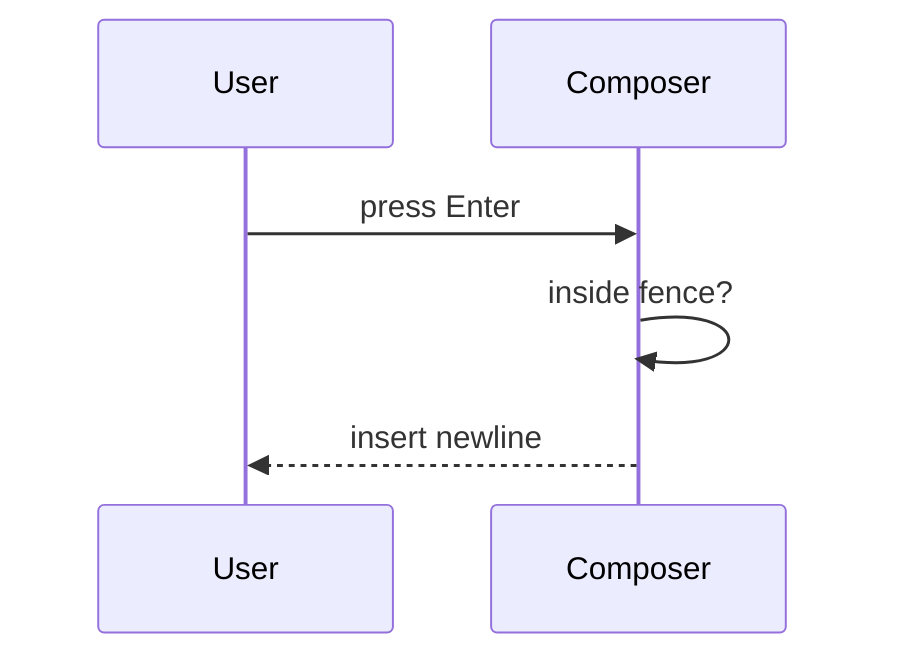

# PSCI Create Pull Request

Write the pull request for a teammate who did not watch the work happen. They can open the Files tab. They cannot recover the purpose from a path list.

Read [writing-style.md](writing-style.md) before writing the body. Follow it for all original PR prose.

Template headings, checklist lines, and ticket links stay exactly as specified below even when they conflict with sentence-case headings.

## Audience

The reviewer is missing the conversation, the ticket rabbit holes, and the dead ends. Answer two questions first:

1. Why does this exist?
2. What is now true that was not true before?

If a sentence only helps someone who already knows the diff, cut it.

## Hard bans

Never put any of these in the PR body:

- A files-changed list
- `git diff --stat`, path inventories, or "touched X, Y, Z"
- New file, module, or API inventories by path
- File trees
- HTML explainers (GitHub will not open them)
- AI attribution, co-author trailers, or tool watermarks
- Sycophantic filler or "comprehensive" throat-clearing

`git diff` is for you. The Files tab is for the reviewer. The body is the why.

Do not invent product claims, metrics, or motivations that are not in the ticket, the conversation, or the diff. If the ticket and the diff disagree, say so.

## Workflow

1. Confirm branch, ticket key, and git state.
2. Read the Jira ticket and the actual diff until you can state the purpose in one paragraph without looking at paths.
3. Commit with a conventional message if there are uncommitted changes the user asked to ship.
4. Push with upstream tracking.
5. Create the PR with `gh`, using the exact section headings below.

```bash
git status --short --branch
git log --oneline -5
git diff [base]...HEAD
```

Inspect the diff to understand behavior. Do not paste that output into the PR.

Commit:

```bash
git commit -m "feat(DEV-1234): short imperative subject" -m "Why this change exists.
What behavior is now different."
```

Push:

```bash
git push -u origin HEAD
```

Never force push without explicit user approval. Never update git config. Never add `Co-authored-by` trailers for AI tools. Never skip hooks unless the user asks.

## PR title

`DEV-XXXX <type>: <description>`

- Ticket key first, uppercase
- Conventional type: `feat`, `fix`, `refactor`, `chore`, `docs`, `test`, `perf`
- Description is the human-facing change, not a file name

Examples:

- `DEV-1235 fix: keep Enter from sending chat messages inside code fences`
- `DEV-4321 feat: add Okta SSO login`
- `DEV-2890 refactor: share validation between invite and signup`

## PR body

Use these headings, in this order, with the `---` separators. Do not add sections. Do not rename sections.

```markdown
### Ticket(s)

[DEV-####](https://procurementsciences.atlassian.net/browse/DEV-####)

---

### Problem Statement

---

### Scope of Work

---

### Related Work

---

### Quality Checklist

- [ ] **Tested in a non-prod environment**
- [ ] **Validated my changes via unit, integration, and/or e2e tests**
- [ ] **(Optional) Reviewed with a PM and Designer**
- [ ] **(Optional) Observability and alert setup**

---

### Test Plan

```

Create it with a HEREDOC so markdown survives:

```bash
gh pr create --title "DEV-1234 fix: short description" --body "$(cat <<'EOF'
[formatted_body]
EOF
)" --base "[base_branch]"
```

### Ticket(s)

One Jira link per ticket. Nothing else.

### Problem Statement

The why. Write it for someone who has never seen the ticket.

Cover:

- Who hurts today, and how
- What is broken, missing, or unsafe
- What happens if we do not ship this

Use the product name for the thing that changed: the chat composer, the token refresher, the invoice export. Not the file that implements it.

Bad:

> This PR updates keyboard handling in the chat composer and adds coverage.

Good:

> Authors writing code in chat hit Enter and send a half-finished message. Support keeps seeing truncated requests. The composer should treat a fence as a text area, not a submit shortcut.

### Scope of Work

What is now true. Behavior, contracts, and flow. Not an inventory.

Lead with the change in the world. Then show it. Pick the smallest visual that makes the point. Skip visuals on a one-line copy fix.

For UI changes, include screenshots or recordings when you have them.

Use the `show-me` patterns below, GitHub-safe only. Do not list files, modules, or paths. Naming a user-facing feature or a service is fine. Naming `src/hooks/useComposer.ts` is not.

Bad:

> - Updated `ChatInput.tsx`
> - Modified `useComposer.ts`
> - Added `codeFence.ts`
> - Added unit tests

Good:

> Enter inside a fenced code block inserts a newline. Cmd-Enter still sends.

```text
on(Enter)
  if cursor is inside a code fence
    insert newline
    return
  submit message
```

### Related Work

Links only: other PRs, tickets, RFCs, design specs. If there is nothing to link, write `None.`

Do not dump local research or plan file paths. Those are not review artifacts.

### Quality Checklist

Keep the four lines verbatim. Check a box only when that work actually happened. Leave optional items unchecked unless a PM, designer, or observability pass really happened.

### Test Plan

What a reviewer should do with the running app or the failing case. Steps, data, and edge cases.

Do not list test files. Do not write "covered by unit tests" as a substitute for a path a human can follow. Mention checks only if they were actually run.

## Show the change

Follow the `show-me` skill for conversation explainers. In the PR body, use only what GitHub renders.

Place each visual next to the sentence it supports. One good diagram beats three.

**Pseudocode** for logic:

```text
on(save)
  if content is unchanged
    return cached result
  write new content
  return fresh result
```

**Call tree** for runtime order. Names of operations, not files:

```text
submitForm
  createSession
    persistPrompt
    launchAgent
  navigateToSession
```

**Component tree** for UI structure. Component names, not paths:

```tsx
<SessionPage>
  useSessionEvents()
  <SessionToolbar>
    <RunSkillButton>
```

**Mermaid** for interaction or data flow:



**Conceptual diff** when the surrounding shape already exists. Diff the behavior, not the repo layout:

```diff
 on(Enter)
-  submit message
+  if cursor is inside a code fence
+    insert newline
+    return
+  submit message
```

Do not use file-layout diffs, file trees, or local HTML artifacts in the PR body.

## Writing the prose

Follow [writing-style.md](writing-style.md). In this skill that means:

- Purpose first, then the change, then how to check it
- Short sentences. One idea each
- Active voice. Name the actor
- Pick one term and keep it
- No em dashes, no double hyphens in prose, no decorative emoji
- No banned filler: utilize, leverage, facilitate, streamline, crucial, notably, furthermore, moreover
- Command flags like `--base` are fine. Double hyphens in sentences are not
- You are writing original copy. Do not invent meaning. Do not pad.

## After create

Return the PR URL, title, and base branch. Stop. No "next steps" sermon.
